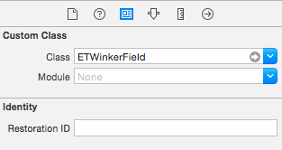

##

[](https://travis-ci.org/Ersen Tekin/ETWinkerField)
[](http://cocoapods.org/pods/ETWinkerField)
[](http://cocoapods.org/pods/ETWinkerField)
[](http://cocoapods.org/pods/ETWinkerField)


## Usage

####Via Storyboard
You can put a `UITextField` on storyboard and set it's class as `ETWinkerField`. You can access through **Identity Inspector** Here's a screenshot.


####Additional Customizations

```objective-c
// wink images
UIImage* iconImageShown = [UIImage imageNamed:@"wink.png"];
UIImage* iconImageHidden = [UIImage imageNamed:@"wink-hidden.png"];
    
// ATTENTION!
// insert hidden image FIRST
NSMutableArray* arrayImages = [[NSMutableArray alloc] initWithObjects:iconImageHidden, iconImageShown, nil];
self.passwordTextField.arrayStatusImages = [arrayImages mutableCopy];
```

## Installation

ETWinkerField is available through [CocoaPods](http://cocoapods.org). To install
it, simply add the following line to your Podfile:

```ruby
pod "ETWinkerField"
```

Then run `pod install`


## TODOs
- Add test coverage
- Fix irrelevant spacing after hide-to-show switch.

## Author

Ersen Tekin, ersen.tekin@gmail.com

## License

ETWinkerField is available under the MIT license. See the LICENSE file for more info.
